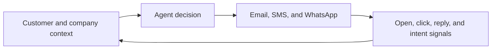

Since February, I have spent roughly six months building two pieces of software: a customs-data analysis system covering 13 South American countries, and an AI export-sales agent that can research prospects, plan outreach, and act across multiple channels.

I do not have an IT background, and I still have not personally written a line of code.

This is not a “two products built from zero with AI” success story. Both products still need to prove themselves in real business workflows. It is about something else I regret: **I documented almost none of the work while it was happening.**

## I was waiting for a finished moment that never arrived

When I started in February, I intended to make videos and write about the process. I kept postponing it.

Part of that was the inconvenience. Part of it was probably my personality. The product never felt ready enough to explain. It seemed more reasonable to wait until the data was stable, the feature set was complete, and the results were easier to defend.

Product development does not volunteer that moment.

Solving one problem reveals deployment, permissions, cost, billing, and customer support. “I will write when it is finished” gradually becomes a way to preserve nothing.

My view now is that documentation is not marketing applied after the product is complete. It is part of the build itself.

It preserves why I made a decision, which hypothesis failed, what stopped the project, and what eventually moved it forward. Publicly, it also shows that a product did not appear fully formed. It emerged through a series of uncertain choices.

## Product one: making customs data usable by AI agents

I previously worked in international trade and experimented with customs-data visualization years ago. I knew the value was not limited to finding a shipment. The data could help explain an importer's buying scale, supplier structure, source markets, and changes in its supply chain.

In February, several conditions aligned. I had domain experience in trade data. AI coding lowered the cost of turning analysis into software. AI agents also suggested a different interface to the information.

I began building [TradeScope Customs Data](https://fengtalk.ai/data), covering 13 South American countries. The goal was not another set of reports that a person must inspect page by page. I wanted the data and analysis to become context an agent could use directly.

An agent could read an importer's purchasing scale, main suppliers, source countries, and supply-chain changes, then use that context for classification, research, and outreach strategy.

The hard part appeared quickly.

The 13 countries do not share one clean schema, and data quality varies. I also wanted the reports to reflect my own supply-chain analysis rather than merely rearrange raw records. At the same time, data analysis cannot tolerate obvious contradictions or invented conclusions.

AI could generate code and reports, but it could also drift or hallucinate. Keeping analysis consistent across different data structures, while verifying that reports did not contradict themselves, became difficult enough that I paused for roughly a month.

Once I found a way forward, the challenge moved from “can it generate a report?” to “can this become a product?” A working demo is not a deployable service. Hosting, cost, access control, billing, support, and the automation of data downloads, report generation, and distribution all had to close into one operational system.

TradeScope is now in its final build stage. That does not mean the market has validated it.

## Product two: turning export outreach into a context-rich agent loop

Once the customs-data system existed, I faced the next question: how should this information enter the actual export-sales workflow?

In July, I began building an AI export-sales agent on top of an open-source application. It has since become part of a broader research and outreach workflow inside [FengTalk.ai](https://fengtalk.ai).

The premise is simple. Current language models are already capable. In many business workflows, what they lack is not a more elegant one-off prompt but context that is continuous, complete, and able to change.

If a salesperson must repeatedly copy an email, reconstruct the customer background, ask the model, and paste the answer back into another system, the workflow is too cumbersome to sustain.

I want the agent to use several layers of context at once:

- the prospect's website, products, and markets;
- purchasing scale, suppliers, and supply-chain changes from customs data;
- our own products, advantages, pricing rules, and operating boundaries;
- emails, SMS messages, and WhatsApp conversations already sent;
- signals such as opens, clicks, replies, and on-site activity;
- the background, personality, and writing style assigned to each virtual salesperson.

Only then can the agent judge the current state of the account, decide what to do next, and determine whether the previous outreach plan should change.

It also needs hands and feet: the ability to send email, SMS, and WhatsApp messages, check for new signals, and, when appropriate, prepare a product catalog, presentation page, or other customer-specific material.

When the prospect replies or produces a new interaction signal, the system wakes the agent again. It reads the updated context, revises the plan, and continues. That feedback loop is much closer to my idea of a virtual salesperson than generating a single cold email.

The demo now runs end to end. The next step is not adding more features. It is placing the system inside real export workflows and observing whether it can actually support prospecting and early-stage follow-up.

## The hardest part was not asking AI to write code

The hardest part of these six months was not generating an individual function. It was connecting moving, fallible, interdependent parts into a system that could be deployed, maintained, and operated at a controllable cost.

A more sensible learning path might have begun with a narrow utility. I did not take that path. I started with two systems that combined messy data, many modules, and real operational workflows.

I regret that choice a little. If I started again, I would probably reduce scope earlier and validate the critical path sooner.

Yet I do not regret what I learned through the work. The larger question was never only whether I could finish two products. It was this: **Can someone without a technical background use AI to turn accumulated industry experience into software that genuinely runs?**

I do not have the final answer yet.

Both products have moved beyond the idea stage, but neither operational reliability nor commercial value should be declared before real results exist. Building in public should not turn an experiment into a success story before the evidence arrives.

## Documenting the unfinished work from here

I will now document what happens when these products enter real workflows. I also plan to reconstruct specific lessons from the past six months: normalizing customs data across countries, controlling hallucination in generated reports, moving from demo to production, and letting an agent advance a sales process in response to customer signals.

I intend to leave at least one record each week and, when the work allows, shorter updates every day or two.

I want to document what failed as well as what worked.

I am no longer waiting for everything to be complete before presenting a tidy story. For me, the value of building in public is precisely that it preserves the decisions, mistakes, and changes that would otherwise disappear.

This post is the new first entry.
