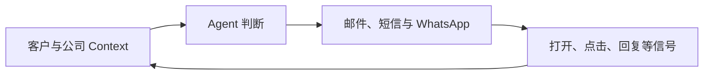

从今年 2 月到现在，我花了大约半年时间做两个软件：一个覆盖南美 13 个国家的海关数据分析系统，以及一个能够调查客户、规划开发动作并执行多渠道触达的 AI 虚拟外贸业务员。

我没有 IT 背景，到现在也没有亲手写过一行代码。

但这篇文章不是一个“零基础用 AI 做出两个产品”的成功故事。两个产品都还需要在真实业务中继续验证。它记录的是另一件让我有些后悔的事：**这半年，我几乎没有把构建过程公开记录下来。**

## 我一直在等一个并不存在的完成时刻

2 月刚开始时，我想过拍视频、写文章，把过程留下来。后来一直没有做。

可能是怕麻烦，也可能是性格使然。我总觉得产品还没有做好，现在讲不够完整。等数据更稳定、功能更完整、结果更明确以后，再开始记录似乎更合理。

但产品开发不会主动给出这样一个时刻。

一个问题解决以后，后面通常还有部署、权限、成本、支付和客户服务。所谓“做好以后再讲”，最后很容易变成什么都没有留下。

我现在的判断是：记录不是产品完成后的营销包装，它本身就是构建过程的一部分。

它让我保留当时为什么做一个选择、哪个假设失败了、什么问题让项目停下来，以及后来怎样重新推进。对外，它也让别人看到产品不是突然出现的，而是在一次次不确定的判断中形成的。

## 产品一：让 AI Agent 能够直接使用海关数据

我以前做过外贸，也很早就尝试过海关数据的可视化分析。我知道这些数据的价值不只是查询一笔交易，它还可以帮助人理解一个进口商的采购规模、供应商结构、来源国和供应链变化。

今年 2 月，几件事碰到了一起：我对外贸和海关数据已有一些积累，AI coding 降低了把分析方法做成软件的门槛，而 AI Agent 又提出了一个新的使用方式。

我开始构建 [TradeScope 海关数据](https://fengtalk.ai/data)，覆盖南美 13 个国家。目标不是再做一套必须由人逐页阅读的报表，而是把数据和分析结果变成 Agent 可以调用的 Context。

Agent 可以读取某个进口商的采购规模、主要供应商、来源国和供应链变化，再把这些信息用于客户分类、背景调查和开发策略。

真正困难的部分很快出现了。

13 个国家的数据字段并不统一，质量也参差不齐。我还希望报告能够体现自己对供应链的分析角度，而不是把原始数据重新排版一遍。数据分析又不能容忍明显的自相矛盾和错误。

AI 可以写代码、生成报告，也会出现幻觉和漂移。怎样让分析在不同数据结构上保持一致，怎样验证报告没有互相冲突，这个问题一度让我停了大约一个月。

找到解决方向以后，挑战从“能不能生成报告”变成了“能不能成为产品”。Demo 可以运行，并不等于系统可以上线。部署、成本、权限、支付、服务，以及数据下载、报告生成和内容发布的自动化流程，都需要真正闭环。

这个产品现在进入收尾阶段，但“可以运行”仍然不等于“已经被市场证明”。

## 产品二：把外贸获客变成一个有 Context 的 Agent 循环

有了海关数据以后，我开始问下一个问题：这些信息怎样真正进入外贸获客流程？

今年 7 月，我开始在一个开源软件的基础上构建 AI 虚拟外贸业务员。它后来成为 [FengTalk.ai](https://fengtalk.ai) 中一条更完整的客户研究与触达工作流。

我的出发点很简单：现在的大模型已经足够聪明，很多业务场景里真正缺少的不是一次更漂亮的 Prompt，而是持续、完整、能够更新的 Context。

如果每次都要业务员复制邮件、整理客户背景、询问 AI，再把结果复制回原系统，这种使用方式本身就很难持续。

我希望 Agent 能够同时使用几类信息：

- 客户的网站、产品和市场；
- 海关数据里的采购规模、供应商和供应链变化；
- 我们自己的产品、优势、报价和业务规则；
- 已经发出的邮件、短信和 WhatsApp 消息；
- 客户有没有打开、点击、回复，以及在网站上产生的互动信号；
- 不同虚拟业务员各自的经历、性格和表达方式。

这些信息组合起来，Agent 才能判断客户当前处于什么状态、下一步应该做什么，以及原来的开发计划是否需要调整。

判断之后，它还需要“手和脚”：发送邮件、短信和 WhatsApp，检查新的客户信号，并在适合的时候准备产品目录、演示页面或其他个性化素材。

客户回复或产生新的互动后，系统再次唤醒 Agent。它重新读取当前 Context，调整计划，再继续推进。这个反馈循环，比单次生成一封开发信更接近我理解的虚拟业务员。

系统的 Demo 目前已经基本跑通。下一步不是继续堆功能，而是把它放进真实外贸流程，观察它是否真的能够帮助完成获客和初步跟进。

## 最难的并不是让 AI 写出代码

回头看，这半年最难的事情不是让 AI 生成某一个函数，而是把许多会移动、会失败、会互相影响的部分组合成一个可部署、可维护、成本可控的系统。

更稳妥的学习方式，可能是先做一个单一功能的小工具。我没有这样开始。我一上来选择的就是两个数据复杂、模块很多、还需要进入真实业务流程的系统。

我有一点后悔。重新开始的话，我可能会更早缩小范围，更早验证最关键的环节。

但考虑到这半年通过实践学到的东西，我又不后悔。因为我真正想验证的并不只是两个产品能否做出来，而是：**一个没有技术背景的人，能不能借助 AI，把过去的行业经验变成真正可以运行的产品？**

现在还没有最终答案。

两个产品都已经跨过“只有想法”的阶段，但能否稳定服务真实客户、能否形成商业价值，仍然需要实际结果证明。Build in Public 不应该把这个实验提前包装成成功。

## 从现在开始，记录未完成的部分

接下来，我会把产品进入真实业务后的表现记录下来，也会补写这半年遇到的具体问题：不同国家的海关数据怎样统一，AI 报告的幻觉怎样控制，Demo 怎样走向 Production，以及 Agent 怎样根据客户信号持续推进销售流程。

我希望至少每周留下记录。如果状态允许，也会尝试每一两天发布一次短记录。

不只记录做成了什么，也记录没有做成什么。

我不再等所有事情完成以后，再讲一个被整理得很完整的故事。对我来说，公开构建真正有价值的地方，恰恰是让那些原本会消失的判断、试错和变化留下来。

这篇文章，就是新的第一条记录。
