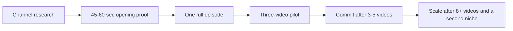

I am building an AI-assisted production line for faceless YouTube videos.

Producing the video is not the only hard part. An earlier and more important question is: **Is a reference channel worth studying, what is actually worth learning from it, and when is the evidence strong enough to justify more investment?**

If those judgments remain scattered across chats and folders, I will eventually forget why a decision was made. I have therefore begun turning channel research into a traceable decision ledger.

This article records the current research, decisions, and gates. It is not a claim that I have found a guaranteed channel model. It is a living experiment snapshot.

## Separate three different decisions

I no longer let a vague conclusion such as “this channel looks good” trigger a production commitment. Research must support three different decisions.

| Decision | Question |
|---|---|
| Bounded pilot | Is the format worth a low-cost opening proof? |
| Full channel commitment | Can I produce complete episodes consistently, and does owned audience data support continuing? |
| Scale | Are quality and unit economics stable, and can the production line transfer to a second niche? |

An external channel report can support the first decision. It usually cannot support the other two. Public view counts do not reveal a target channel's CTR, retention, RPM, revenue, traffic sources, or subscriber conversion, and those private metrics should not be guessed.

The evidence that moves the decision forward must come from my own production and publishing experiments.

## The current priority case: Mr. Death

Mr. Death is a faceless channel that uses second-person narration to explain death, serious injury, and bodily mechanisms.

As of August 25, 2026, I had preserved and analyzed its complete 26-video long-form catalog, every thumbnail, complete English transcripts for five frozen performance tiers, and public storyboards for the same five videos.

| Metric | Public snapshot |
|---|---:|
| Videos | 26 |
| Public subscribers | About 130,000 |
| Observed catalog views | 8,071,473 |
| Median views | 189,920 |
| Mean views | 310,441 |
| P25 / P75 | 94,099 / 395,489 |
| Maximum | 1,183,984 |
| Videos above 10,000 | 26 / 26 |
| Top-video share | 14.67% |
| Top-three share | 39.06% |

The channel is not supported by a single accidental outlier. The distribution is still strongly right-skewed: the maximum is 6.23 times the median, so the average should not be treated as dependable output.

## Active again, but the restart evidence is immature

The channel stopped uploading for 116 days between April 15 and August 9, 2026. It then published four videos in sixteen days, at gaps of seven, three, and four days.

That is enough to classify it as active-recovered rather than abandoned. The four restart uploads currently have a median of 82,978 views, below the pre-hiatus median of 270,257. However, three were younger than fourteen days at the snapshot. This cannot establish demotion, loss of monetization, or permanent demand decline.

I also do not plan to wait indefinitely. Another public snapshot of the target now has less decision value than publishing one original validation video and collecting owned evidence.

## The transferable value is the story grammar

Twenty-five of the twenty-six titles repeat a closely related promise:

`What [Dying / Getting Killed] by X Feels Like`

Across the five script samples, the recurring structure is:

1. enter an ordinary situation in the second person;
2. introduce an invisible risk or small bad decision;
3. make the danger irreversible;
4. re-hook with a question or dark humor;
5. explain one bodily mechanism;
6. escalate by minute, hour, month, or stage;
7. return to outcome, prevention, or survival value.

The median sample is 13 minutes 42 seconds long, contains 2,573 words, and is delivered at roughly 169.8 WPM. Maximum, median, and low-view samples all use the broader grammar, so it looks more like a stable channel structure than a viral-only trick.

This does not prove that any sentence caused the public performance. Public evidence can identify associations and stable grammar; it cannot replace retention data.

## Visual production is feasible; image generation is not the main risk

The public storyboards show a body built from simple scenes, grey figures, a white death-narrator character, organ and mechanism diagrams, icons, speech bubbles, numbers, and short labels. The format does not depend on ten minutes of continuous cinematic generative video.

A practical original workflow could use:

- generated but original scene backgrounds;
- reusable original characters and poses;
- deterministic text, arrows, timers, and diagrams;
- an image-first body with stable light motion;
- a higher video budget reserved for the first 45-60 seconds.

The difficult parts are medical accuracy, advertiser suitability, asset rights, character consistency, and the possible discontinuity between a cinematic opening and a mostly static body.

## The Mr. Death decision

The current decision is `conditional_test`.

**Approved:** Produce one completely original 45-60 second opening proof, then decide whether to build the first complete episode.

**Not approved:** Copying the channel identity, title-topic pairs, scripts, white ghost character, thumbnails, voice, or real assets; or committing to batch production without owned data.

The candidate validation topic is `What Dying From Heatstroke Feels Like`. It is absent from the observed Mr. Death catalog and supports a clear mechanism, progressive timeline, prevention value, and non-graphic visuals.

The opening must pass factual, advertiser-safety, character-consistency, motion-stability, opening-to-body transition, production-time, and cash-cost gates. Only then should I build one complete episode. A three-video pilot follows only if the first full episode is acceptable.

## Past Made Us: six references are not six models to copy

For the current history niche, I also analyzed six reference channels and 346 public long-form videos. They serve three different purposes.

| Order | Channel | Mature median views | ≥10K | Current use |
|---:|---|---:|---:|---|
| 1 | Mack | 32,308 | 74.6% | First stable production-model deep dive |
| 2 | Neon Rush | 19,374 | 84.4% | Series efficiency plus originality risk |
| 3 | Explain In Paint | 11,803 | 50.8% | Validate which patterns belong to the niche |
| 4 | Basically Primitive | 2,505 | 20.9% | Multi-character visual storytelling lesson |
| 5 | TP Dossier | 2,706 | 23.1% | Outlier packaging lesson only |
| 6 | Boneink | 997 | 8.3% | Monitor until more data matures |

This comparison prevents me from turning one thumbnail or viral upload into a channel model. The current learning order is Mack → Neon Rush → Explain In Paint: identify a stable production model, then use an independent channel to test which patterns are niche-level rather than channel-specific.

## Other completed channel deep dives

| Channel | Status | Current decision |
|---|---|---|
| Deep Epoch | `conditional` | A production contract is feasible; factual review and provenance remain conditions |
| Zoxi | `conditional` | Pass a 90-second quality gate before full automated production |
| Ancient Empire Documentary | `learning-only` | Learn from its cold opens and timelines, but do not use it as a replication model |

These statuses are not view forecasts.

- `primary`: evidence and risk support an original validation experiment;
- `conditional`: worth testing, but only under explicit conditions;
- `learning-only`: structural lessons are allowed, but a production replication brief is not;
- `reject`: identity, evidence, or risk makes the channel unsuitable as a primary reference.

## What every channel study must preserve

To keep analysis from scattering again, every channel record must preserve five things:

1. **Snapshot**: evidence date, complete catalog, and lifecycle;
2. **Status**: `primary / conditional / learning-only / reject`;
3. **Decision**: what to do now and what explicitly not to do;
4. **Next gate**: one next experiment at a time;
5. **Feedback**: production records and owned YouTube Analytics.

“Evidence completeness: 100%” only means that the research contract's required fields have records. It does not mean that audio rights, private performance, and commercial viability are all known.

## Is this enough information to decide?

It is enough for half of the decision.

The research can determine which channels deserve study, which structures are worth borrowing, and whether an original low-cost validation is justified.

It cannot establish that a new channel deserves a long-term commitment, and it certainly cannot prove scalable profitability. Crossing those gates requires owned evidence: full-episode production time, cash cost, rework rate, quality gates, CTR, first-30-second retention, average view duration, satisfaction, and subscriber conversion.

That is why I built this research and decision ledger.

The purpose is not to make every report longer. It is to know **where the next unit of time and budget belongs, and which evidence should make me stop.**
